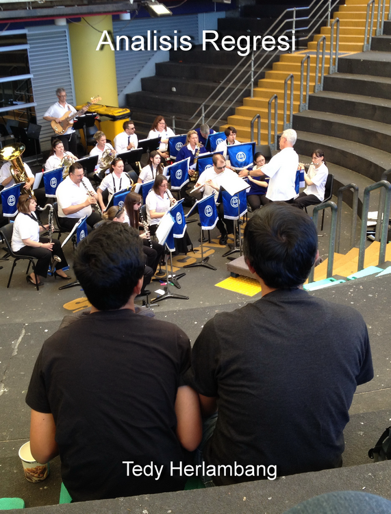

<!-- R global options: R chunk images display without code (no echo); show PDF image over JPG/PNG when available in PDF output -->

```{r setup, include=FALSE}
knitr::opts_chunk$set(echo = FALSE)
options(knitr.graphics.auto_pdf = FALSE)
```

```{r, echo = FALSE}
# google scholar metadata
library(metathis)

if (knitr::is_html_output()) {
  meta() |> 
    meta_google_scholar(
      title = "Analisis Regresi: Disertai Contoh-Contoh Menggunakan R",
      author = "Tedy Herlambang",
      publication_date = "2022",
      isbn = ""
    ) 
}
```

# Kata Pengantar {.unnumbered}

{width="350"} 

Manusia sering punya rasa ingin tahu tentang bagaimana suatu hal berkaitan dengan hal yang lain. Dengan kata lain, kita sebagai manusia seringkali tertarik melihat hubungan antara sebuah variabel dengan variabel lain. Di dunia akademik maupun praktik, salah satu alat yang bisa dipakai untuk mempelajari kaitan antar variabel adalah analisis regresi.

Aplikasi pengetahuan tentang hubungan antar variabel dapat dipakai untuk membuat prediksi dan skenario *what if*: bagaimana sebuah variabel akan berubah jika terjadi perubahan pada variabel lain yang berkaitan. Prediksi dan skenario menguji pemahaman kita tentang hubungan antar variabel. Jika kita tidak tepat memahami hubungan antar variabel ini, prediksi dan skenario yang kita buat bisa tidak tepat juga.

Analisis regresi sejatinya menganalisis hubungan antar variabel. Dengan bantuan komputer dan pemikiran yang cermat, analisis regresi dapat menjadi alat untuk membedah data yang kompleks. Tetapi, komputer tidak bisa berpikir dan merencanakan sendiri. Komputer hanya membantu peneliti melakukan perhitungan secara cepat, agar peneliti memiliki lebih banyak waktu untuk berpikir dan memperbaiki model analisisnya.

Di dalam buku singkat ini, saya akan membahas analisis regresi dan penerapannya. Pembahasan dimulai dengan regresi linier sederhana, kemudian dilanjutkan ke pembahasan regresi berganda. Program yang akan digunakan adalah R [@rcoreteam2021] yang bisa diunduh secara gratis di [sini](https://www.r-project.org/).

Tetapi buku ini bukan buku tentang R. Juga bukan buku tentang statistik. Materi untuk belajar R sangat banyak tersedia secara *online* misalnya [Introduction to R](https://cran.r-project.org/doc/manuals/r-devel/R-intro.html). Pembaca juga bisa mengikuti berbagai topik di [R-bloggers](https://www.r-bloggers.com/). Tujuan buku ini adalah untuk memperkuat pemahaman pembaca tentang model regresi sebagai salah satu alat analisis yang bisa diterapkan pada berbagai bidang akademik maupun praktik. Saya mengharapkan buku ini bisa menjadi *live book* yang berkembang sesuai saran pembaca.

<strong>Analisis Regresi</strong> hak cipta ada pada <a href="https://bangtedy.github.io/analisisregresi">Tedy Herlambang</a> dan diedarkan berdasarkan <a rel="license" href="http://creativecommons.org/licenses/by-nc-nd/4.0/">Creative Commons BY-NC-ND 4.0 International License</a>. Anda bebas menggunakan isi buku ini untuk tujuan non-komersial, dengan menyebutkan sumbernya ke <a href="https://bangtedy.github.io/analisisregresi">https://bangtedy.github.io/analisisregresi</a>.

*Cara mengutip*:

> Herlambang, Tedy. 2022. Analisis Regresi.URL <https://bangtedy.github.io/analisisregresi>.

#### Disclaimer {.unnumbered}

The information is this book is provided without warranty. The authors and publisher have neither liability nor responsibility to any person or entity related to any loss or damages arising from the information contained in this book.

*Terakhir diperbarui pada: `r format (Sys.Date(), '%d %B %Y')`*.
